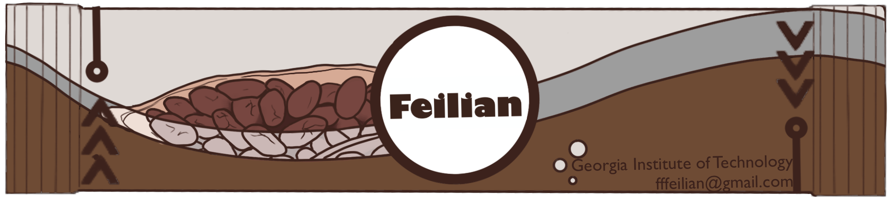

# Hi, I'm Feilian Huang 👋

**AI Software Engineer @ Cadence Design Systems** · **Independent Researcher**

I build agentic AI systems for chip design by day, and study how AI reshapes science, elections, and markets by night.

---

## 🔧 Work

**Software Engineer II, Cadence Design Systems** (2025–present · San Jose)
- 🤖 **PG Agent** — LLM-powered power-grid routing: from 1,000+ lines of manual scripting to near zero
- 💾 **ChipRTL** — LLM + RAG + MCP for automated RTL code generation via high-level synthesis
- 🧩 **Innostack** — business-unit-wide AI platform unifying Cadence tools through natural language

Previously: Software Developer Intern @ Cadence (RAG pipeline for the JedAI LLM), @ AirMettle (patent co-author, video processing), Research Assistant @ Georgia Tech.

🎓 B.S. Georgia Tech (Math + CS) · M.S. Johns Hopkins (CS)

📄 Full work history on [my website](https://edgahab.github.io/#work)

---

## 🔬 Research

**AI & computing**
- *Unverified Foundations: How AI-Generated Mathematics Builds on Itself* — [data & code](https://doi.org/10.5281/zenodo.23232471)
- *The First AI-Saturated Election* (with Yujia Liu) — [SSRN](https://doi.org/10.2139/ssrn.7520300) · submitted to *Election Law Journal*
- *Client-Side Measurement of Free-Tier LLM Inference* — [data](https://doi.org/10.5281/zenodo.23053564)
- *Pushdown Is Not Free* — [Zenodo](https://doi.org/10.5281/zenodo.22964229)
- *The Review Lottery* — [arXiv](https://arxiv.org/abs/2610.06591)

**Early American maritime history, 1783–1815** (with Yujia Liu)
- *From Wartime Service to Canton* — [SSRN](https://doi.org/10.2139/ssrn.7568639) · under review at *Journal of the Early Republic*
- *Yankees in the Sound* — [SSRN](https://doi.org/10.2139/ssrn.7568619) · under review at *IJMH*
- *The Neutral-Carrier Recovery, 1809–1811* — [SSRN](https://doi.org/10.2139/ssrn.7568640) · under review at *Scandinavian Economic History Review*

📄 Full list with links on [my website](https://edgahab.github.io/#research)

---

## 📫 Connect

- 🌐 [edgahab.github.io](https://edgahab.github.io/)
- 💼 [LinkedIn](https://www.linkedin.com/in/feilian-huang-a6ba801a1)
- 🆔 [ORCID](https://orcid.org/0009-0006-2214-0233)
- 📧 fffeilian@gmail.com

---

